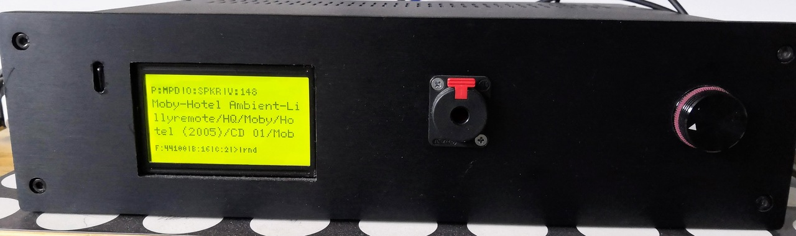
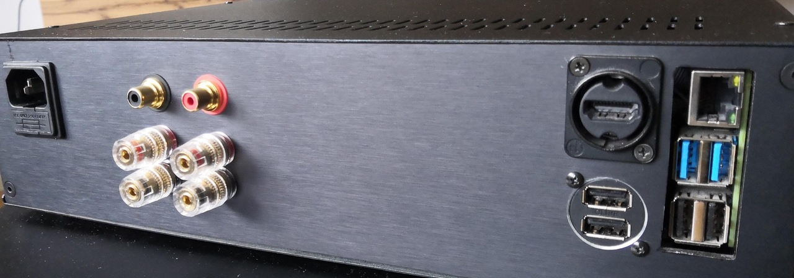
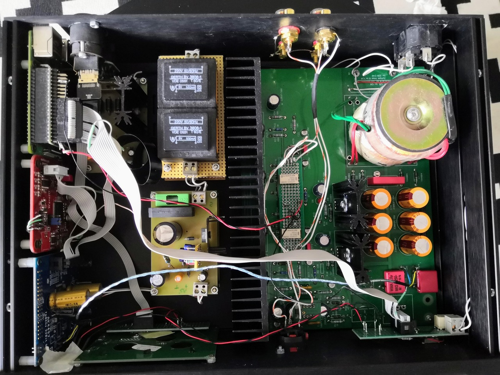

# RSPlayer - Music Player for Raspberry PI and software controller for AK4xxx DAC chips.
### Currently it supports *Spotify* and *Music Player Daemon* as backend players and provide unique UI experience.
### Optionaly you can connect input/output devices to GPIO header: 
- #### *DAC board* for hardware volume control and other dac settings like sound quality and digital filter
- #### *Rotary encoder* for volume control and power on 
- #### *IR Receiver* for player remote control
- #### *OLED display* for player state info
- #### *Relay* for output audio signal selection.
---

## TODO: DEMO and Video
## Hardware requirements
Mandatory:

- Raspberry PI 4 - for best audio quality. It will work with older 64bit models as well.

Optional:
- Diy friendly AK44xx DAC board i.e. [Diyinhk](https://www.diyinhk.com/shop/audio-kits/), [JLSounds](http://jlsounds.com/products.html) ...
- USB to I2S converter board. i.e. [WaveIO](https://luckit.biz/), [Amanero](https://amanero.com/), [JLSounds](http://jlsounds.com/products.html) ...
- Infrared Receiver TSOP312xx. i.e. [TSOP31238](https://eu.mouser.com/ProductDetail/Vishay-Semiconductors/TSOP31238?qs=5rGgbCH0pB1jaK4I0GvRsw%3D%3D)
- A1156 Apple Remote Control
- Oled display ST7920 128x64 (from Amazon, Ebay ...)
- Rotary Encoder (from Amazon, Ebay ...)
- Headphone Amp board i.e. [Whammy](https://diyaudiostore.com/products/whammy-completion-kit?_pos=3&_sid=bf6542f23&_ss=r)
- Power Supply
- Metal Case

## Installation - ssh access to rpi is required
- ### Raspberry PI configuration
    Tested on RPI4 with Raspberry Pi OS Lite (64-bit)
    Make sure you have following entries in `/boot/config.txt`:
    ```
    dtparam=i2c_arm=on
    dtparam=spi=on
    dtoverlay=gpio-ir,gpio_pin=17
    dtoverlay=rotary-encoder,pin_a=15,pin_b=18,relative_axis=1,steps-per-period=1
    gpio=18,15,19=pu
    gpio=22,23=op,dh
    ```

- ### Dependencies
    - Install MPD and LIRC:
        ```
        sudo apt install -y mpd lirc
        sudo systemctl enable mpd
        sudo systemctl enable lircd
        ```
    - [Librespot](https://github.com/librespot-org/librespot) is provided in the distribution package

- ### RSPlayer
    Install rsplayer:
    ```
    wget https://github.com/ljufa/rsplayer/releases/download/v0.3.0/rsplayer_v0.3.0_arm64.deb
    sudo dpkg -i --force-overwrites rsplayer_v0.3.0_arm64.deb
    sudo systemctl enable rsplayer
    ```
- ### Verify installation
    - Reboot RPI with `sudo reboot`
    - After reboot is done, open browser and navigate to `http://<rpi ip address>:8000/#settings`
    - If page can not loaded check log for errors `journalctl -u rsplayer.service -f -n 300`

## Configuration
TODO

## Architecture


## My Audio Streamer Implementation
**[KiCad files](DOCS/kicad/rpi_connector/)** could be found here



